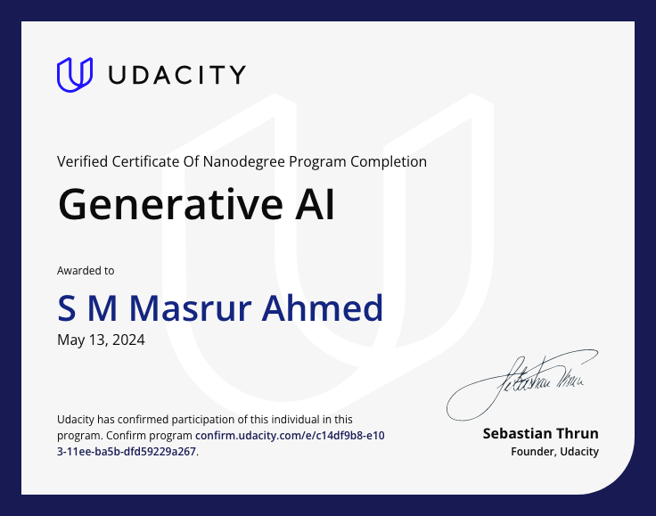

# Udacity Generative AI

Welcome to the Udacity Generative AI repository! This repository is dedicated to exploring and implementing generative artificial intelligence techniques through Udacity's educational platform.

## About

Udacity Generative AI aims to provide resources and code examples for learning and applying generative AI techniques taught in Udacity courses and nanodegree programs. From generating images and text to creating music and audio, this repository serves as a hub for exploring the fascinating world of generative AI through Udacity's curriculum.

## Repository Contents

- **Code Samples**: Explore various code samples and implementations of generative AI techniques covered in Udacity courses and nanodegree programs.
- **Tutorials**: Step-by-step guides and tutorials on how to implement generative AI algorithms taught in Udacity courses.
- **Resources**: Additional resources, research papers, and links related to generative AI and Udacity.
- **Certificates**: Certificates of completion for Udacity courses and nanodegree programs related to Generative AI.

## Certificate of Completion

Congratulations on completing a Udacity course or nanodegree program related to Generative AI! Here is your certificate of completion:

Confirmation URL:  [Certificate URL](https://confirm.udacity.com/e/c14df9b8-e103-11ee-ba5b-dfd59229a267) 

## Get Started

1. Clone this repository to your local machine.
2. Explore the provided code samples, tutorials, and resources.
3. Dive into the world of Generative AI with Udacity and enhance your skills in artificial intelligence and machine learning!

## Contributors

We welcome contributions from the community! If you have code samples, tutorials, or resources to share, feel free to submit a pull request.

## Connect with Us

Have questions, feedback, or ideas? Reach out to me.

Let's unleash the potential of Generative AI together with Udacity!

