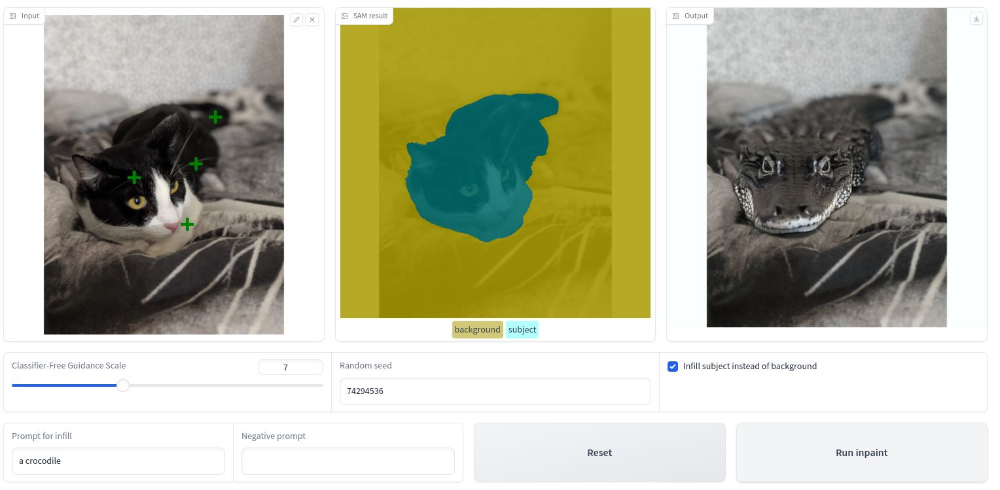

# Project Overview
## Project Introduction

In the class, the use of Generative models in Computer Vision has been explored, along with the application of the Segment Anything Model for selecting subjects in images through provided points and other inputs. Now, it's time to apply this knowledge by building something interesting and fun!

With our app we will be able to swap out the background of an image and substitute it with a computer-generated one described through text.

We can also substitute the subject instead of the background.

With this app, the aim is to swap out the background of an image and replace it with a computer-generated one described through text. The process involves uploading an image, selecting the main object by clicking on it, activating the Segment Anything Model (SAM) to create a mask around the object, refining the mask if necessary, providing a text description for the new background, and generating the final image with the new background or subject.

## Project Summary

The project entails building an app enabling users to select a subject and change its background, or keep the background and change the subject. The workflow includes the following steps:
1. User uploads an image and selects the main object by clicking on it.
2. SAM creates a mask around the selected object, allowing the user to refine it if needed.
3. User provides a text description (and possibly a negative prompt) for the new background.
4. An infill model generates the new background based on the text description.
5. The final image with the new background or subject is displayed.

Optionally, users can choose to invert the mask and substitute the subject while keeping the background. This versatile app can be used for tasks such as swapping backgrounds, swapping subjects, and removing objects.

The project involves writing the code to power the main functionality of the app, including calling the SAM model, processing its output, and utilizing a text-to-image diffusion model to generate the new background or subject.

Let's get started!
